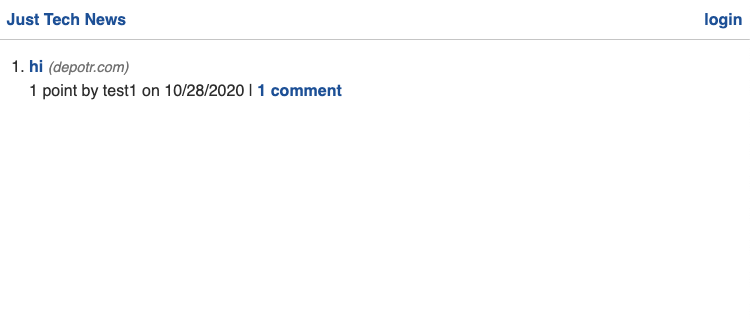

# Tech Blog
1. [ Description. ](#desc)
2. [ Questions.](#ques)
3. [ Screenshot.](#scrsh)

## Description:
### CMS-style blog site similar to a Wordpress site, where developers can publish their blog posts and comment on other developers’ posts as well

## Questions:
### My gitHub profile:
## https://github.com/Alex2055
### Email me:
## alexfromnashville@gmail.com

 #
 

    